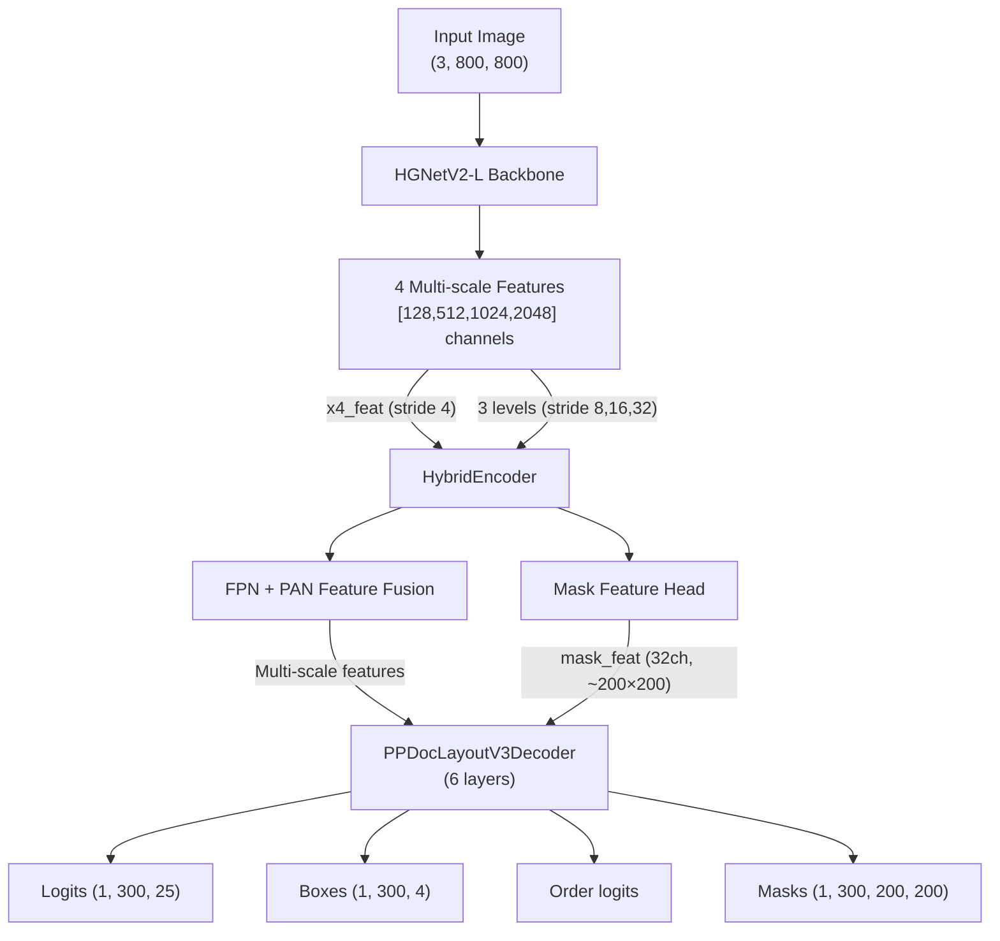

# PP-DocLayoutV3 Layout Model Architecture Research

## Overview

The document layout detector is **PP-DocLayoutV3** (PaddlePaddle/PP-DocLayoutV3_safetensors), based on the **RT-DETR** (Real-Time Detection Transformer) architecture, adapted for document layout analysis with mask prediction. It's a standard HuggingFace Transformers model.

> [!IMPORTANT]
> This is fundamentally different from the vision model conversion — the vision model was a ViT (patch-based transformer), while this is a CNN+Transformer detection model with multi-scale feature pyramids and deformable attention.

---

## Architecture Summary

---

## Component Details

### 1. Image Preprocessing
- **Input**: PIL Image (any size)
- **Resize**: 800×800 (bicubic)
- **Rescale**: ÷255 to [0,1]
- **Normalize**: mean=[0,0,0], std=[1,1,1] (effectively identity)
- **Output**: `pixel_values`: (batch, 3, 800, 800) float32

### 2. HGNetV2-L Backbone
- CNN backbone with 4 stages producing features at strides [4, 8, 16, 32]
- Channel dimensions: [128, 512, 1024, 2048]
- Uses **frozen BatchNorm2d** (buffers, not learnable params)

### 3. Hybrid Encoder
- **AIFI Layer**: Transformer encoder (self-attention + FFN) applied to the stride-32 feature map.
- **Top-down FPN**: Lateral convolutions + upsampling (bilinear `scale_factor=2`).
- **Bottom-up PAN**: Downsampling convolutions + fusion via CSPRepLayer blocks.
- **Mask Feature Head**: FPN-style mask generation → bilinear upsample → produces 32-channel mask features at ~200×200.

### 4. Transformer Decoder (6 layers)
Each decoder layer has:
- **Self-attention**: Standard multi-head attention.
- **Cross-attention**: **Multi-Scale Deformable Attention** — the key complex operation.
- **FFN**: Standard feed-forward.
- **Global Pointer**: For reading order prediction.
- **Mask Query Head**: MLP that produces per-query mask weights.

### 5. Multi-Scale Deformable Attention (Critical Component)
This is the most conversion-challenging operation.
- Iterates over multiple spatial scales (3 levels).
- At each level: reshapes value features → bilinear grid_sample → weighted sum.
- Sampling locations are predicted by the model (learned offsets from reference points).
- 8 attention heads, 4 sampling points per level.

### 6. Output Format
- `logits`: (B, 300, 25) - Class logits.
- `pred_boxes`: (B, 300, 4) - Bounding boxes.
- `order_logits`: (B, 300) - Reading order.
- `out_masks`: (B, 300, 200, 200) - Instance segmentation masks.

### 7. Post-Processing (CPU/Host-side)
Post-processing is done by the image processor and `layout_detector.py`:
1. Sigmoid on logits → topk(300) → filter by threshold.
2. Box format conversion (cx,cy,w,h → x1,y1,x2,y2) + scale to image size.
3. Order sequence extraction.
4. **Mask → polygon conversion** using cv2 (`findContours` + `approxPolyDP`).
5. NMS and unclip ratio adjustments.

---

## Key Conversion Challenges

### 🔴 Critical: `grid_sample` in Deformable Attention
- `nn.functional.grid_sample` in `bilinear` mode is supported by CoreML (`mb.resample`) but requires careful handling.
- Original code iterates over feature levels -> dynamic shapes.
- **Solution**: Feature map sizes are deterministic if input is fixed to 800x800.

### 🟡 Important: Dynamic Shape Operations
- `value.split` based on spatial shapes requires fixed input resolution (800x800).
- Stride 8: 100×100 = 10000
- Stride 16: 50×50 = 2500
- Stride 32: 25×25 = 625

### ⚪ Not Needed in CoreML: Post-Processing
The following happen **after** the model forward pass and should remain on CPU:
- Sigmoid + topk filtering
- Box format conversion + scaling
- Mask → polygon (cv2-dependent)
- NMS

---

## Architecture Comparison: Vision Model vs Layout Model

| Aspect | Vision Model (GLM-OCR) | Layout Model (PP-DocLayoutV3) |
|---|---|---|
| Base architecture | ViT (Vision Transformer) | RT-DETR (CNN + Transformer) |
| Input | Pre-chunked patches | Full image (1, 3, 800, 800) |
| Variable shapes | Enumerated patch counts | Fixed 800×800 input → fixed intermediate shapes |
| Key challenge | Attention mask; Conv3d→Conv2d | `grid_sample` in deformable attention |
| Attention type | Scaled dot-product | Multi-scale deformable (grid_sample) |
| Post-processing | None (raw embeddings) | Complex (threshold + NMS + polygon) |
